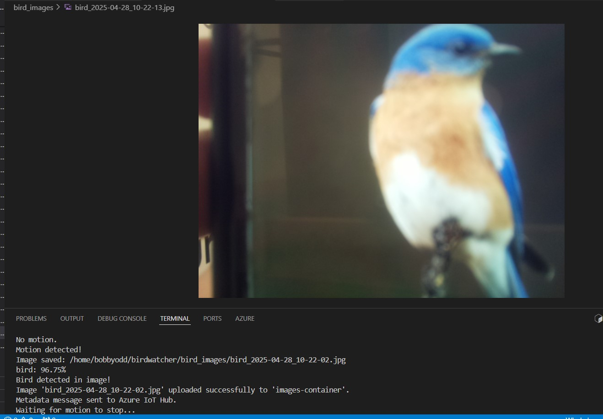
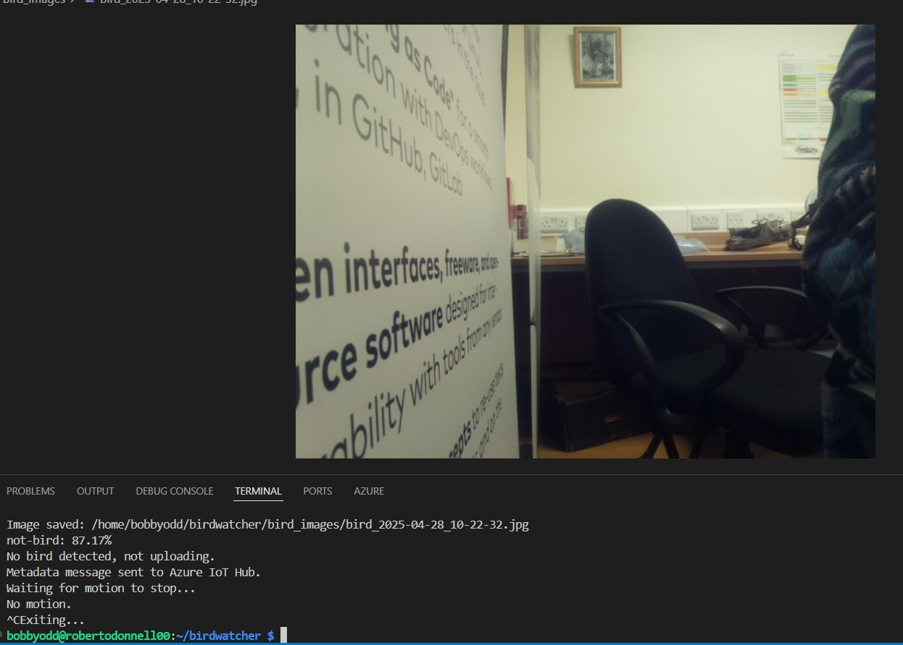
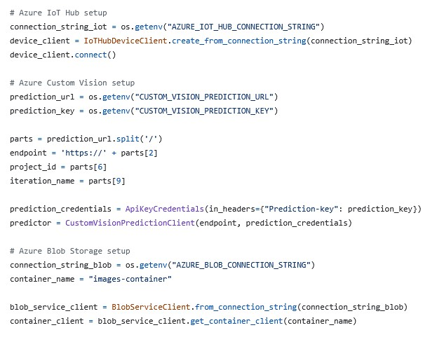
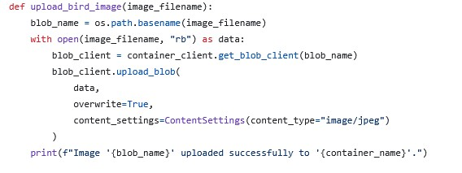
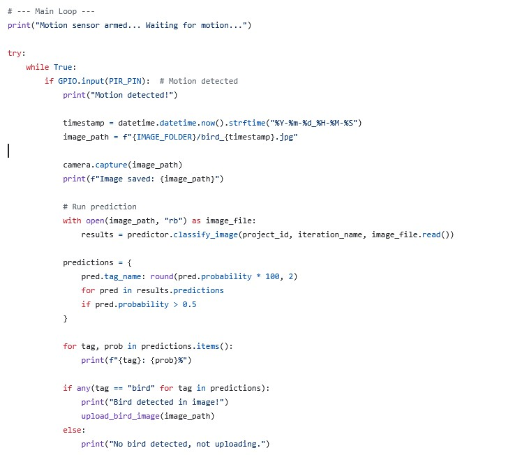
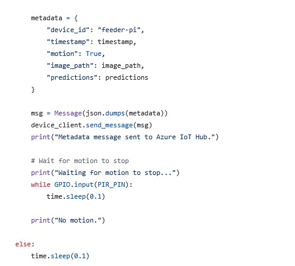

# Birdwatcher

## Project Overview

This project is an Internet of Things (IoT) system designed to detect motion using a Raspberry Pi and PIR sensor, capture images, and analyze them using a cloud-based Custom Vision AI model. The system detects motion, takes a picture, scans the picture with Custom Vision AI, if a bird is detected the image will be uploaded to Blob Storage (otherwise stored locally), metadata is sent to Azure.

## Features

- Motion detection via PIR sensor on Raspberry Pi  
- Automatic image capture and storage  
- Cloud upload (Azure Blob & IoT Hub)  
- Integration with Custom Vision AI for image classification  
- Informational flow tracking and basic alerting/logging  

## Technologies Used

- **Hardware:** Raspberry Pi 4, PIR Sensor, Pi Camera  
- **Languages:** Python  
- **Cloud:** Azure (Custom Vision + Blob Storage) 

## System Logic Flow

1. **Idle:** The system waits for motion via PIR sensor.  
2. **Triggered:** When motion is detected, a photo is captured.    
3. **Classification:** The Custom Vision AI service analyzes the image.
4. **Processing:** If a bird is detected, the picture is sent to cloud storage.
5. **Output:** Based on classification, the result is logged or sent to a user system.

## How to Run

1. Connect the PIR sensor and camera to the Raspberry Pi.  
2. Clone this repository onto the Raspberry Pi.  
3. Set up a Python environment and install dependencies (see requirements.txt)

    ```bash
    pip install -r requirements.txt
    ```

4. Configure cloud credentials and endpoints eg. connections strings, device ID. etc. 
5. Run the main detection script:

    ```bash
    python app.py
    ```

## Sample Output

### Bird Detected ###


### No Bird Detected ###


## Notes

- For best performance, test in a well-lit environment.  
- Camera angle and PIR sensor range may need manual adjustment.  
- Ensure cloud billing caps are in place to avoid unexpected charges.

## Code Breakdown

- Azure IoT Hub Setup. Connects the Raspberry Pi to Azure IoT Hub as a device. It fetches the connection string from environment variables. device_client.connect() establishes a live connection.
- Azure Custom Vision Setup. Loads the Custom Vision endpoint and API key. Extracts the base endpoint, project ID, and iteration name from the prediction URL (a common Azure pattern). Sets up authentication with your prediction key. Creates a predictor client object used to send images for analysis.
- Azure Blob Storage Setup. Loads your Azure Blob Storage connection string. Defines which container to use.


    
    blob_name = os.path.basename(image_filename)

Extracts just the filename from a full path.
E.g., from "images/bird1.jpg" → "bird1.jpg"
This will be the name used in the blob container.

    with open(image_filename, "rb") as data:

Opens the image file in binary read mode ("rb") so it can be uploaded.

    blob_client = container_client.get_blob_client(blob_name)

Gets a reference to the blob (like a "file handle" in the cloud) inside the container for this image.

    blob_client.upload_blob(
        data,
        overwrite=True,
        content_settings=ContentSettings(content_type="image/jpeg")
    )

Uploads the binary image data to Azure Blob Storage.

- overwrite=True: replaces the blob if one with the same name already exists.

- content_settings: tells Azure this is a JPEG image (helps with previewing in browsers and tools).


    print(f"Image '{blob_name}' uploaded successfully to '{container_name}'.")

Prints a confirmation message to the console.


    
    print("Motion sensor armed... Waiting for motion...")

A startup message confirming the system is ready.

**Infinite Loop with Motion Detection:**

    while True:
        if GPIO.input(PIR_PIN):

Checks for motion using the PIR sensor (PIR_PIN).
If triggered, the block below runs.

**Capture the image:**

    timestamp = datetime.datetime.now().strftime(...)
    image_path = f"{IMAGE_FOLDER}/bird_{timestamp}.jpg"
    camera.capture(image_path)

Generates a timestamped filename.

Captures a photo and saves it locally.

**Run prediction with Custom Vision:**

    with open(image_path, "rb") as image_file:
        results = predictor.classify_image(...)

Opens the image file in binary mode.

Sends it to the AI model for classification.

**Process predictions:**

    predictions = {
        pred.tag_name: round(pred.probability * 100, 2)
        for pred in results.predictions
        if pred.probability > 0.5
    }

Builds a dictionary of tags with probability > 50%.

**Print results:**

    for tag, prob in predictions.items():
        print(f"{tag}: {prob}%")
    
Outputs prediction results to the console.

**Check for bird detection:**

    if any(tag == "bird" for tag in predictions):
        upload_bird_image(image_path)

If the tag "bird" is found, the image is uploaded.

Otherwise, it prints: "No bird detected, not uploading."



**Create metadata dictionary**

    metadata = {
        "device_id": "feeder-pi",
        "timestamp": timestamp,
        "motion": True,
        "image_path": image_path,
        "predictions": predictions
    }

Bundles relevant info into a dictionary:

- Device name
- Time of detection
- Motion flag
- Saved image path
- AI prediction results

**Send data to Azure IoT Hub**

    msg = Message(json.dumps(metadata))
    device_client.send_message(msg)

Converts metadata to a JSON-formatted message.

Sends it to Azure IoT Hub so it can be logged, displayed, or trigger further actions.

    print("Metadata message sent to Azure IoT Hub.")

Confirms the message was sent.

**Wait for motion to stop before continuing**

    print("Waiting for motion to stop...")
    while GPIO.input(PIR_PIN):
        time.sleep(0.1)

Holds the loop until the PIR sensor no longer detects movement.

Prevents re-triggering the process immediately.

    print("No motion.")

Confirms the area is clear and it's ready for the next trigger.

**Sleep briefly if no motion detected**

    else:
        time.sleep(0.1)

If the PIR didn’t trigger, the script sleeps briefly (100ms) to reduce CPU usage before checking again.
